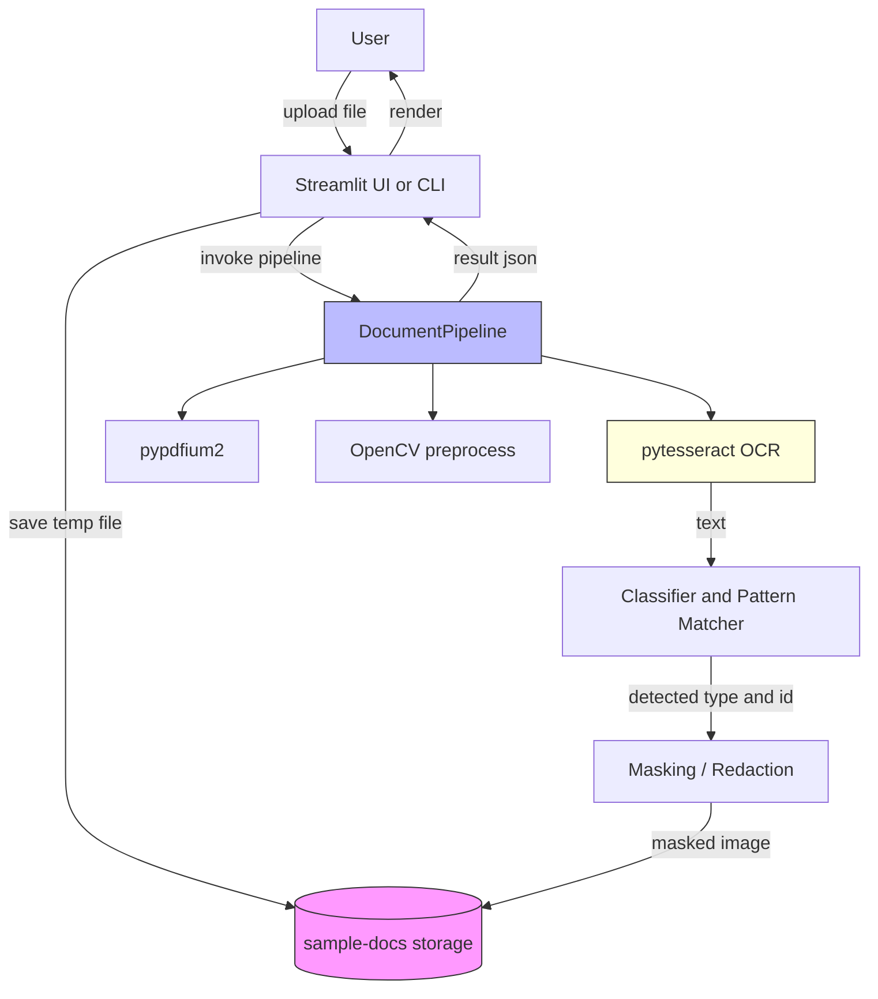
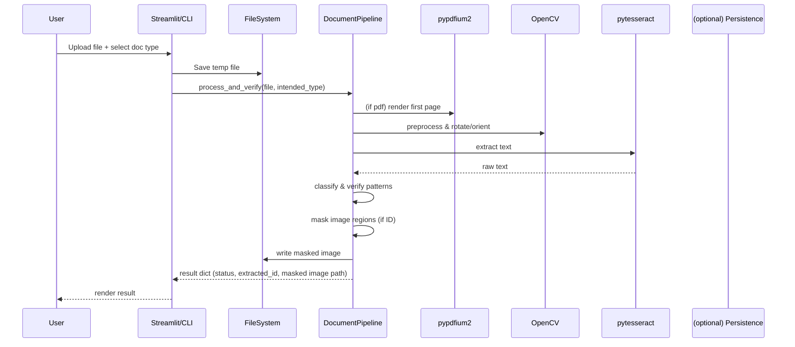
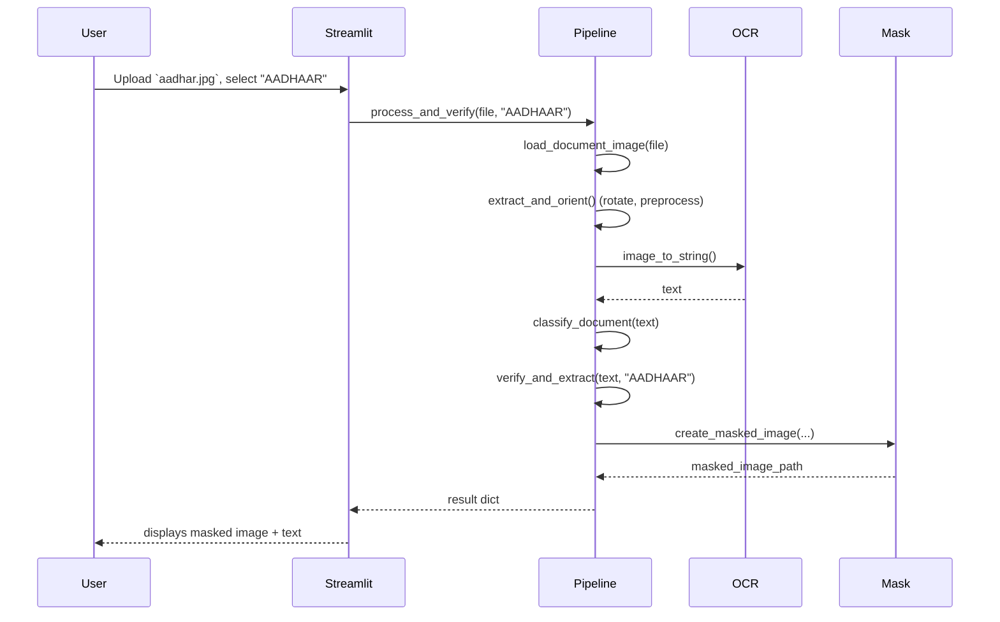
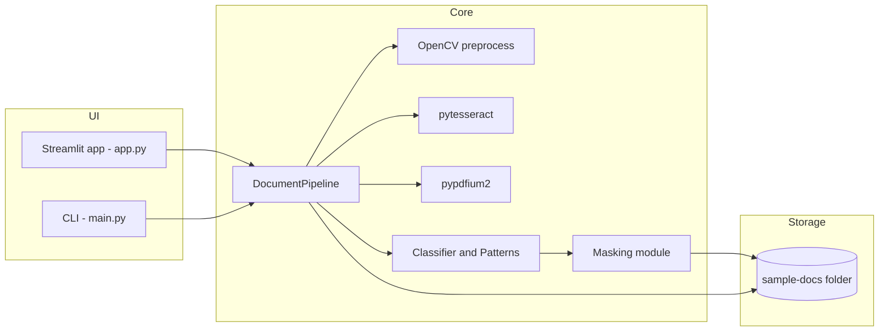
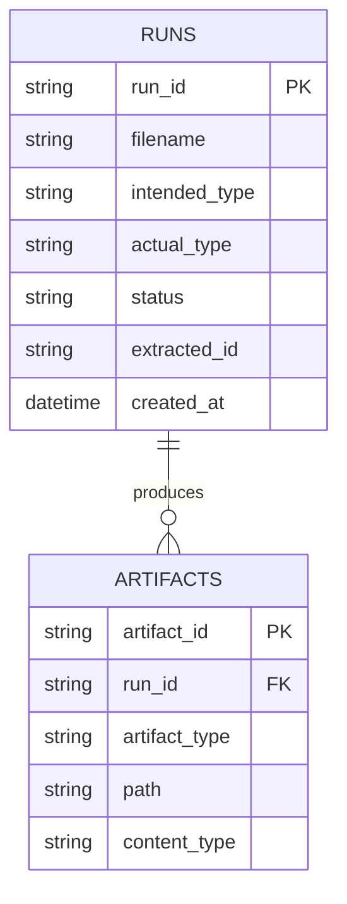

## KYC Verification Pipeline

Small demo pipeline for document classification, verification, OCR extraction and physical redaction.

This repository contains a CLI and Streamlit UI to run the KYC pipeline implemented in `kyc_pipeline.py`.

### What is included
- `kyc_pipeline.py` - main pipeline that loads images/PDFs, runs OCR, classifies documents, extracts IDs, and creates masked images.
- `main.py` - simple interactive terminal program to run the pipeline.
- `app.py` - Streamlit dashboard for quick uploads and visual results.
- `sample-docs/` - storage folder used by the app to hold temporary and masked outputs.

---

## Setup

Prerequisites:

- Python 3.8+ (3.10 recommended)
- A system Tesseract installation (required by `pytesseract`)

Install Tesseract on macOS (Homebrew):

```bash
# install homebrew if you don't have it: https://brew.sh/
brew install tesseract
```

Create and activate a virtual environment (recommended):

```bash
python3 -m venv .venv
source .venv/bin/activate
```

Install Python dependencies:

```bash
pip install -r requirements.txt
```

Notes on packages:
- `pypdfium2` is used to rasterize PDF pages. If you have trouble installing it, refer to its docs: https://pypdfium2.readthedocs.io/
- If you prefer CPU-only OpenCV, `opencv-python-headless` is used here to avoid GUI dependencies.

---

## Run (Terminal / CLI)

The `main.py` script launches an interactive CLI where you choose a document type and provide a file path.

Example:

```bash
python main.py
```

Follow the prompts to select the document type and enter the full path to the image or PDF file.

Hints:
- Supported input types: `jpg, jpeg, png, webp, pdf`.
- Output masked images and temporary files are saved under `sample-docs/`.

---

## Run (Streamlit UI)

The `app.py` provides a web UI for uploads and visual inspection. Start Streamlit from the repository root:

```bash
streamlit run app.py
```

This will open a browser window (or give you a local URL) where you can select an intended document type and upload images or PDFs.

UI behavior:
- Use the left panel to pick a document type and upload the file.
- Click "Execute KYC Pipeline" to run the pipeline. Results, masked image preview, and raw OCR text will appear on the right.

---

## Troubleshooting / Tips

- If OCR returns no text or unexpected results, try increasing image resolution or using clearer scans.
- If `pytesseract` cannot be found, ensure `tesseract` binary is installed and accessible on your PATH (try `tesseract --version`).
- For PDFs with multiple pages the current pipeline only processes the first page.

## License & Attribution

This project is provided as-is for testing and demonstration purposes.

---

If you'd like, I can also add a small example file and a test script that runs the pipeline against it.

---

## Architecture Diagrams (Mermaid)

Below are several diagrams to make the flow and architecture easier to understand: a Data Flow Diagram (DFD), an overall system flow, a sequence diagram for a single document run, a high-level design (HLD) component diagram, and an ER diagram for persisted artifacts.

> Note: GitHub and many Markdown renderers support Mermaid. If your renderer doesn't show the diagrams, you can paste the Mermaid blocks into the online Mermaid Live Editor (https://mermaid.live) to view them.

### 1) Data Flow Diagram (DFD)



Short explanation: The user uploads a document via the Streamlit UI (or CLI). The file is saved to `sample-docs/` and passed to `DocumentPipeline`. PDFs are rasterized using `pypdfium2`. Images are preprocessed by OpenCV. OCR (pytesseract) extracts text used by classifier/pattern matcher. If an ID is found it is physically redacted on the image and saved back to `sample-docs/`. Results are returned to the UI.

### 2) Overall System Flow



### 3) Sequence (detailed single-request run)



### 4) High-Level Design (HLD) / Component Diagram



Short HLD note: `DocumentPipeline` orchestrates PDF rendering, image preprocessing, OCR extraction, classification, ID extraction, and masking. The UI layers simply persist an uploaded file and call the pipeline.

### 5) ER Diagram (Artifacts & Metadata)

This project currently uses the filesystem for outputs rather than a database. The ER diagram below models a possible minimal persistence schema if you want to store runs and artifacts in a DB.



Explanation: A `RUNS` table stores each pipeline execution (intent, result, extracted id). `ARTIFACTS` stores file outputs (masked images, original upload) linked to runs by `run_id`.

---

If you prefer I can:
- Export PNGs of each diagram and place them under `docs/` for renderers that don't support Mermaid.
- Add a small `examples/` image and a test script that runs through `main.py` automatically and writes a sample DB row.

Let me know which follow-ups you want and I'll add them.
