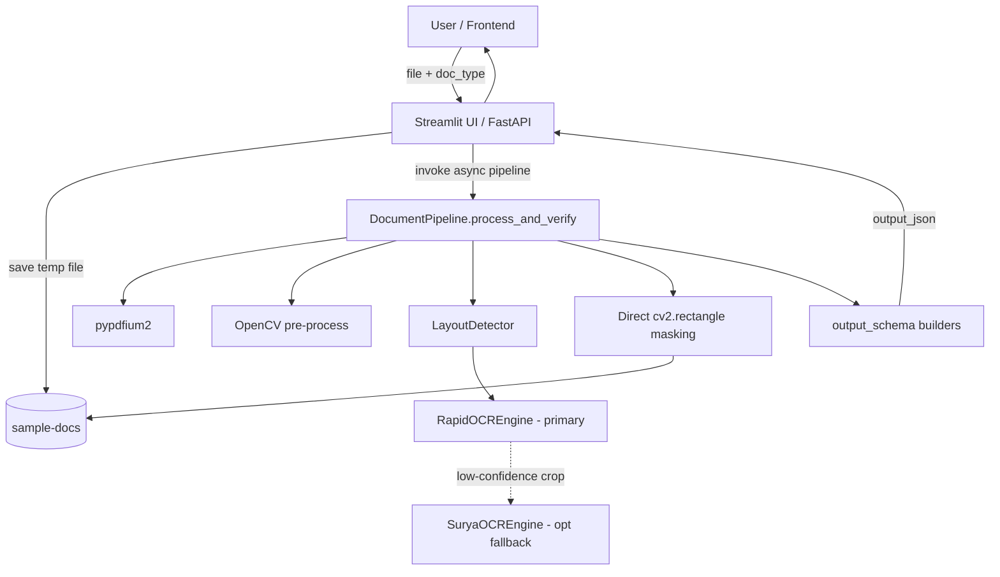
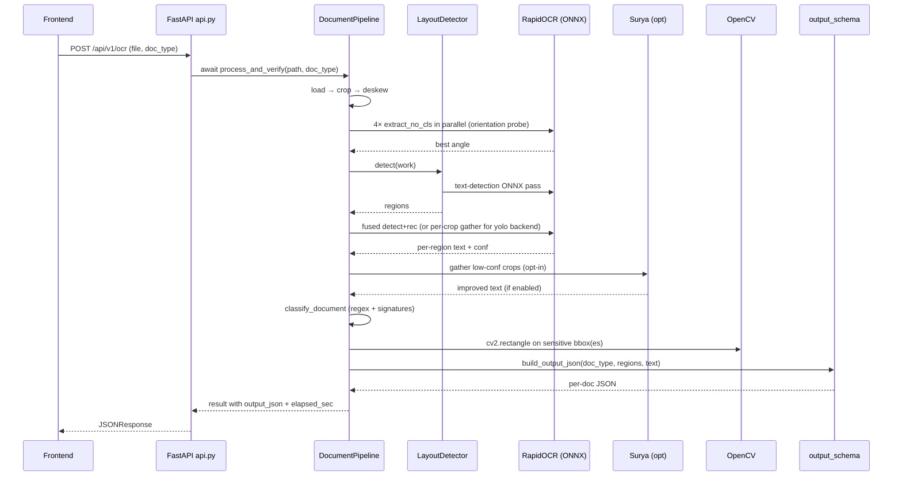
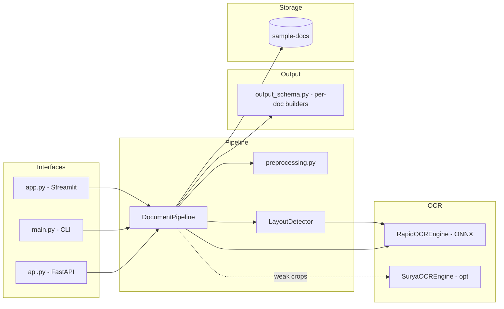

# Recrivio KYC OCR Pipeline

Fast, async OCR + classification + redaction for Indian KYC documents.
Locates text first, OCRs only the crops concurrently, classifies the
document, extracts structured fields into a stable per-document JSON
contract, and produces a redacted image.

| Document             | `document_type` values emitted by the API                                  |
| -------------------- | -------------------------------------------------------------------------- |
| Aadhaar              | `aadhaar_front_bottom`, `aadhaar_back` (both when one image has both sides) |
| PAN                  | `pan`                                                                       |
| Passport             | `passport_front`, `passport_back`                                           |
| Voter ID             | `voterid_front`, `voterid_back`                                             |
| Driving Licence      | flat schema — `license_number` + `dob` (top-level `document_type` is `null`) |

---

## Quick start

```bash
# 1. Setup
python3 -m venv venv && source venv/bin/activate
pip install -r requirements.txt

# 2. FastAPI service (for frontends)
uvicorn api:app --reload --port 8000

# 3. Streamlit UI (visual sanity check + JSON viewer)
streamlit run app.py

# 4. CLI (interactive, mostly for local testing)
python main.py
```

Smoke-test the HTTP endpoint:

```bash
# Generic — caller picks the doc type
curl -F "file=@sample/pan-test.png" -F "doc_type=PAN" \
     http://127.0.0.1:8000/api/v1/ocr | jq

# Or hit the per-doc-type endpoint directly (no doc_type form field)
curl -F "file=@sample/pan-test.png" \
     http://127.0.0.1:8000/api/v1/ocr/pan | jq
```

---

## Why this design

The original pipeline did four full-page PaddleOCR passes (one per 90°
rotation) plus a Surya fallback plus four full-page Tesseract passes for
mask boxes. That's slow.

The new pipeline never sends the full page to a recognition engine. It
**locates** text regions in one cheap pass, then **reads only the
crops** — concurrently. Surya is invoked only on individual
low-confidence crops, never the full page. Masking uses the layout
detector's box geometry directly with `cv2.rectangle`, so Tesseract is
gone entirely.

End-to-end latency on the sample images dropped from **~14 s → ~1–3 s**
per document.

---

## Architecture

```
┌─────────────────────────────────────────────────────────────────────┐
│                          process_and_verify                          │
│                                                                      │
│  load → auto-crop → deskew → orient → resize ─→ work_image           │
│                                                                      │
│       Stage 1 — LOCATE                                               │
│       LayoutDetector.detect(work) → [Region, …]                      │
│         backend: 'rapidocr_det' (default) | 'yolo' (pluggable)       │
│                                                                      │
│       Stage 2 — READ                                                 │
│         rapidocr_det:  one fused detect+rec pass (RapidOCR/ONNX)     │
│         yolo:          asyncio.gather over crop OCRs                 │
│                                                                      │
│       Stage 3 — FALLBACK                                             │
│         crops where conf < fallback_threshold → asyncio.gather Surya │
│                                                                      │
│       Stage 4 — MASK                                                 │
│         find sensitive region by regex on each region's text         │
│         cv2.rectangle on its bbox (Aadhaar: partial mask keep last4) │
│                                                                      │
│       Stage 5 — RESPOND                                              │
│         build_output_json(doc_type, regions, text)                   │
│         → per-doc-type contract                                      │
└─────────────────────────────────────────────────────────────────────┘
```

### Stages in detail

1. **Preprocess** — `pypdfium2` renders PDFs; OpenCV auto-crops the
   document and deskews. Orientation is then probed at 0°/90°/180°/270°
   in parallel using RapidOCR with the `cls` (angle-class) model
   **disabled**, scored as `landscape_bbox_count × avg_conf × text_len`.
   Disabling `cls` is what lets 0° beat 180° — with `cls` on,
   upside-down text gets silently rotated and both score the same.

2. **Locate** — `LayoutDetector` ([layout_detector.py](layout_detector.py))
   returns axis-aligned regions for every text-bearing area. Default
   backend reuses RapidOCR's ONNX text-detection model. A pluggable
   YOLOv8 ONNX backend exists for field-level detection — drop a model
   at `models/layout.onnx` and set `LayoutSettings.backend = 'yolo'`.

3. **Read** — For the line-level default backend, detection +
   recognition are a single fused ONNX pass; re-cropping individual
   lines and re-OCRing them only fragments words. For the YOLO field
   backend, the few coarse field crops are OCR'd in parallel via
   `asyncio.gather` over `asyncio.to_thread` — onnxruntime releases the
   GIL during inference so real concurrency is achieved.

4. **Fallback** — Any region whose recognition confidence falls below
   `OCRSettings.fallback_threshold` (default 0.75) triggers a Surya
   re-OCR on that crop only. Surya is loaded lazily on first need. It is
   **off by default** (`OCRSettings.enable_surya_fallback = False`)
   because the installed `surya-ocr 0.17` is currently brittle against
   `transformers` version skew; flip the flag once the deps are aligned.

5. **Mask** — The pipeline detects which region holds the sensitive ID
   by regex over each region's text, then blacks that region's bbox with
   a single `cv2.rectangle` call. Aadhaar partial-masks every occurrence
   (the 12-digit number prints on both card sides) keeping the right ~34%
   visible so the last 4 digits remain readable.

6. **Respond** — `output_schema.build_output_json` selects the
   appropriate per-doc builder. Each builder runs heuristic + regex
   extraction on the per-region OCR results to produce the JSON
   contract.

---

## Models used

| Role                  | Model                                            | Where loaded                                   | Notes                                                                    |
| --------------------- | ------------------------------------------------ | ---------------------------------------------- | ------------------------------------------------------------------------ |
| Text detection        | PaddleOCR PP-OCR `det` (ONNX)                    | `RapidOCREngine.detect` / `extract`             | Bundled with `rapidocr-onnxruntime`. Releases GIL → safe to thread.       |
| Text recognition      | PaddleOCR PP-OCR `rec` (ONNX)                    | `RapidOCREngine.extract`                        | Same package.                                                            |
| Angle classifier      | PaddleOCR PP-OCR `cls` (ONNX)                    | enabled by default in `extract`, off in `extract_no_cls` | Used by RapidOCR internally to flip 180°-rotated lines. Disabled when probing global orientation. |
| Fallback OCR (opt-in) | Surya foundation + recognition + detection      | `SuryaOCREngine` lazy init                      | ~1.34 GB download on first use. Off by default until deps are pinned.    |
| Layout detector (opt) | Generic YOLOv8 ONNX (e.g. DocLayout-YOLO)        | `_YoloLayout` in `layout_detector.py`            | Optional. Plug in via `LayoutSettings.yolo_model_path`.                  |

No PaddlePaddle dependency, no GPU required.

---

## Project structure

```
ocr-all-classifier/
├── api.py                  FastAPI service (POST /api/v1/ocr[/{doc_type}], GET /healthz)
├── app.py                  Streamlit UI
├── main.py                 CLI entry point
├── kyc_pipeline.py         async DocumentPipeline (locate → read → mask)
├── ocr_engines.py          RapidOCREngine, SuryaOCREngine, async helper
├── layout_detector.py      LayoutDetector + Region; rapidocr_det / yolo backends
├── output_schema.py        per-doc JSON builders + field extractors
├── preprocessing.py        auto_crop / deskew / rotate / resize
├── config.py               dataclasses for OCR/Layout/Mask settings
├── requirements.txt
├── sample/                 input fixtures
└── sample-docs/            masked output images
```

---

## How to use

### FastAPI service

```bash
uvicorn api:app --reload --port 8000
```

Endpoints:

| Method | Path                            | Body / params                                                                                          | Returns                                                        |
| ------ | ------------------------------- | ------------------------------------------------------------------------------------------------------ | -------------------------------------------------------------- |
| GET    | `/healthz`                      | —                                                                                                      | `{"ok": true}`                                                 |
| POST   | `/api/v1/ocr`                   | multipart form: `file` (image/PDF) + `doc_type` (PAN / AADHAAR / PASSPORT / VOTER_ID / DRIVING_LICENSE) | Document-specific JSON (see [JSON responses](#json-responses)) |
| POST   | `/api/v1/ocr/pan`               | multipart form: `file`                                                                                 | Same shape as `/api/v1/ocr` with `doc_type=PAN`                |
| POST   | `/api/v1/ocr/aadhaar`           | multipart form: `file`                                                                                 | Same shape as `/api/v1/ocr` with `doc_type=AADHAAR`            |
| POST   | `/api/v1/ocr/passport`          | multipart form: `file`                                                                                 | Same shape as `/api/v1/ocr` with `doc_type=PASSPORT`           |
| POST   | `/api/v1/ocr/voter-id`          | multipart form: `file`                                                                                 | Same shape as `/api/v1/ocr` with `doc_type=VOTER_ID`           |
| POST   | `/api/v1/ocr/driving-license`   | multipart form: `file`                                                                                 | Same shape as `/api/v1/ocr` with `doc_type=DRIVING_LICENSE`    |

The per-doc-type routes are convenience wrappers — the frontend can
pick the URL based on the doc type the user selected and skip the
`doc_type` form field. They share the generic endpoint's pipeline and
response envelope.

CORS is permissive by default (`*`) — tighten in production by editing
[api.py](api.py).

### Streamlit UI

```bash
streamlit run app.py
```

Pick a document type, upload an image/PDF, click **Execute KYC
Pipeline**. The right pane shows the redacted image preview, an "API
response JSON" expander (the same payload the FastAPI endpoint
returns), and a debug panel with the layout-detection overlay and
orientation angle.

### CLI

```bash
python main.py
```

Prompts for a document type and a file path. Prints the raw text and
the final status.

---

## JSON responses

Every endpoint response is wrapped in the same envelope:

```json
{
  "data": { ... per-doc-type payload ... },
  "status_code": 200,
  "message_code": "success",
  "message": null,
  "success": true
}
```

`confidence` values are integers on a 0–100 scale (`int(round(score *
100))` of RapidOCR's per-region recognition score). Fields that
couldn't be extracted come back as empty strings with `confidence: 0`
— the shape stays stable so the frontend can rely on it.

### PAN

```json
{
  "data": {
    "ocr_fields": [{
      "document_type": "pan",
      "pan_number":  {"value": "ABCDE1234F", "confidence": 100},
      "full_name":   {"value": "John Doe",   "confidence": 99},
      "father_name": {"value": "Richard Doe","confidence": 99},
      "dob":         {"value": "15/08/1990", "confidence": 100}
    }]
  },
  "status_code": 200, "message_code": "success", "message": null, "success": true
}
```

### Aadhaar — emits only the side(s) actually present

```json
{
  "data": {
    "ocr_fields": [
      {
        "document_type": "aadhaar_front_bottom",
        "full_name":  {"value": "John Doe",  "confidence": 99},
        "gender":     {"value": "M",         "confidence": 98},
        "mother_name":{"value": "",          "confidence": 0},
        "father_name":{"value": "",          "confidence": 0},
        "dob":        {"value": "1990-08-15","confidence": 93, "yob": false},
        "aadhaar_number": {
          "value": "123456789012", "confidence": 100,
          "is_masked": false, "input_validation": false
        },
        "image_url": null,
        "uniqueness_id": "0123456789abcdef…fedcba9876543210"
      },
      {
        "document_type": "aadhaar_back",
        "address": {
          "value": "C/O: Richard Doe, House No 100, Main Street, Sample City 110001",
          "confidence": 93,
          "house_number": "100", "district": "Sample District",
          "city": "Sample City", "state": "Sample State",
          "country": "INDIA",    "zip": "110001",
          "first_line": "", "second_line": "",
          "locality": "", "landmark": ""
        },
        "zip":  {"value": "110001", "confidence": 93},
        "care_of": {"value": "Richard Doe", "confidence": 93, "relation": "care_of"},
        "aadhaar_number": {
          "value": "123456789012", "confidence": 100,
          "is_masked": false, "input_validation": false
        },
        "image_url": null
      }
    ]
  },
  ...
}
```

`uniqueness_id` is `sha256(aadhaar_number)` — same person → same hash —
so the backend can dedupe submissions without storing the raw number.
Empty string when the Aadhaar number can't be extracted.

`care_of.relation` is inferred from the prefix in the address:
`C/O → care_of`, `S/O`/`D/O → father`, `W/O → husband`, default `father`.

### Passport (front and back are distinct shapes)

**`passport_front`** — extracted primarily from the MRZ lines, with
labelled-field fallback for `dob`, `doe`, `gender` when MRZ is garbled:

```json
{
  "data": {
    "ocr_fields": [{
      "document_type": "passport_front",
      "country_code":     {"value": "IND",         "confidence": 91},
      "dob":              {"value": "15/08/1990",  "confidence": 91},
      "doe":              {"value": "14/08/2030",  "confidence": 93},
      "doi":              {"value": "15/08/2020",  "confidence": 91},
      "gender":           {"value": "M",           "confidence": 72},
      "given_name":       {"value": "John",        "confidence": 91},
      "nationality":      {"value": "INDIAN",      "confidence": 91},
      "passport_num":     {"value": "A1234567",    "confidence": 91},
      "place_of_birth":   {"value": "SAMPLE CITY, SAMPLE STATE", "confidence": 92},
      "place_of_issue":   {"value": "SAMPLE CITY", "confidence": 92},
      "surname":          {"value": "Doe",         "confidence": 91},
      "mrz_line_1":       {"value": "P<INDDOE<<JOHN<<<<<<<<<<<<<<<<<<<<<<<<<<<<<<", "confidence": 91},
      "mrz_line_2":       {"value": "A1234567<8IND9008156M3008146<<<<<<<<<<<<<<<0",  "confidence": 91},
      "type_of_passport": {"value": "P",           "confidence": 91},
      "passport_validity": null
    }]
  }, ...
}
```

**`passport_back`** — name fields come from positional extraction
(names sit above the Address block), file number / passport number from
regex:

```json
{
  "data": {
    "ocr_fields": [{
      "document_type": "passport_back",
      "address":         {"value": "100, SAMPLE BLOCK, SAMPLE AREA, SAMPLE CITY, SAMPLE DISTRICT, PIN:110001, SAMPLE STATE, INDIA", "confidence": 92},
      "father":          {"value": "Richard Doe",     "confidence": 97},
      "mother":          {"value": "Sarah Doe",       "confidence": 94},
      "file_num":        {"value": "XX1234567890123", "confidence": 100},
      "old_doi":         {"value": "", "confidence": 0},
      "old_passport_num":{"value": "", "confidence": 0},
      "old_place_of_issue":{"value": "", "confidence": 0},
      "pin":             {"value": "110001", "confidence": 92},
      "spouse":          {"value": "", "confidence": 0}
    }]
  }, ...
}
```

### Voter ID

```json
{
  "data": {
    "ocr_fields": [{
      "document_type": "voterid_front",
      "full_name":  {"value": "John Doe",    "confidence": 92},
      "age":        {"value": "35",          "confidence": 95},
      "care_of":    {"value": "Richard Doe", "confidence": 97},
      "dob":        {"value": "1990-01-01",  "confidence": 76},
      "doc":        {"value": "2020-01-01",  "confidence": 0},
      "gender":     {"value": "M",           "confidence": 84},
      "epic_number":{"value": "ABC1234567",  "confidence": 95}
    }]
  }, ...
}
```

A `voterid_back` shape is emitted instead when the image only shows the
address side.

### Driving Licence

The `/api/v1/ocr/driving-license` endpoint returns a minimal identity
contract — the licence number and date of birth:

```json
{
  "data": {
    "document_type": null,
    "license_number": {"value": "HR41 20220002435", "confidence": 95},
    "dob": {"value": "2004-06-09", "confidence": 90, "yob": false},
    "image_url": null
  }, ...
}
```

`dob` is a required field — it is taken from a labelled `DOB` line when
present, otherwise from the earliest date on the card (issue / validity
dates always fall after the birth date).

A Vehicle Registration Certificate sent to this endpoint still returns a
valid, DL-shaped response: its number lands in `license_number` via the
fallback pattern.

### Failure shape

When classification fails, ID extraction fails, or the OCR backend is
unavailable, the same envelope is returned with a populated `message`:

```json
{
  "data": {},
  "status_code": 400,
  "message_code": "failed",
  "message": "Expected PASSPORT, got UNKNOWN",
  "success": false
}
```

---

## Configuration

Every tunable lives in [config.py](config.py):

```python
@dataclass
class OCRSettings:
    primary_lang: str = "en"
    fallback_threshold: float = 0.75       # Surya re-OCR threshold
    enable_surya_fallback: bool = False    # off until surya/transformers pinned

@dataclass
class LayoutSettings:
    backend: str = "rapidocr_det"          # or "yolo"
    yolo_model_path: str = "models/layout.onnx"
    yolo_classes: tuple = ("text","title","list","table","figure")
    score_threshold: float = 0.30
    detect_orientation: bool = True

@dataclass
class MaskSettings:
    pad_ratio: float = 0.18
    aadhaar_visible_ratio: float = 0.34    # right portion kept readable
    merge_gap: int = 22

@dataclass
class Settings:
    ocr: OCRSettings
    layout: LayoutSettings
    mask: MaskSettings
    output_dir: str = "sample-docs"
    work_max_side: int = 2000
```

---

## Architecture diagrams

### Stage flow (DFD)



### Sequence — single FastAPI request



### Component diagram (HLD)



---

## Known caveats

- **Surya fallback is gated off by default** — `surya-ocr 0.17` in this
  venv crashes at inference with `SuryaDecoderConfig has no attribute
  pad_token_id` (transformers version skew). Flip
  `OCRSettings.enable_surya_fallback = True` after pinning compatible
  versions.
- **Generic vs field-level layout** — with the default `rapidocr_det`
  backend, regions are *text lines*, not labelled fields, so identifying
  which region holds the sensitive ID still uses regex over the
  recognised text. To get truly text-recognition-independent field
  routing, plug a trained ID-field YOLO ONNX at `models/layout.onnx` and
  switch the backend to `yolo`.
- **e-Aadhaar fold layout** — the printable "tear-off" mini-card on
  some e-Aadhaar PDFs is intentionally upside-down relative to the main
  page. We can only pick one global orientation; the orientation
  detector reliably picks the main side, but the partial mask on the
  flipped mini-card may end up on the wrong end. Mask the whole bbox
  (set `MaskSettings.aadhaar_visible_ratio = 0`) if that's a concern.
- **Heuristic field extraction** — addresses, names, and ages are
  extracted by regex + label-anchored / positional heuristics, not by a
  field-level model. We emit empty strings with `confidence: 0` when
  extraction can't recover a value confidently rather than guessing.
- **DL DOI without label** — when a DL's `Date of Issue` / `Valid Till`
  labels are missed by OCR, the issue/expiry fallback year-sorts every
  date in the text (earliest = issue, latest = expiry). This can pick
  the DOB year on cards where the DOB is older than the issue date.
- **First-page only for PDFs** — multi-page PDFs are not iterated. PR
  welcome.

---

## License

Provided as-is for testing and demonstration purposes.
