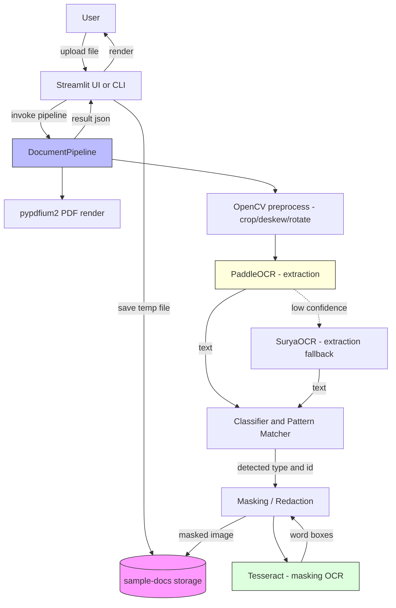
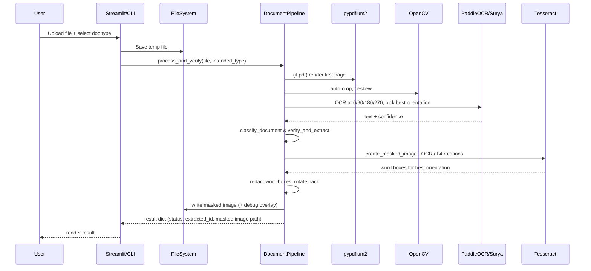
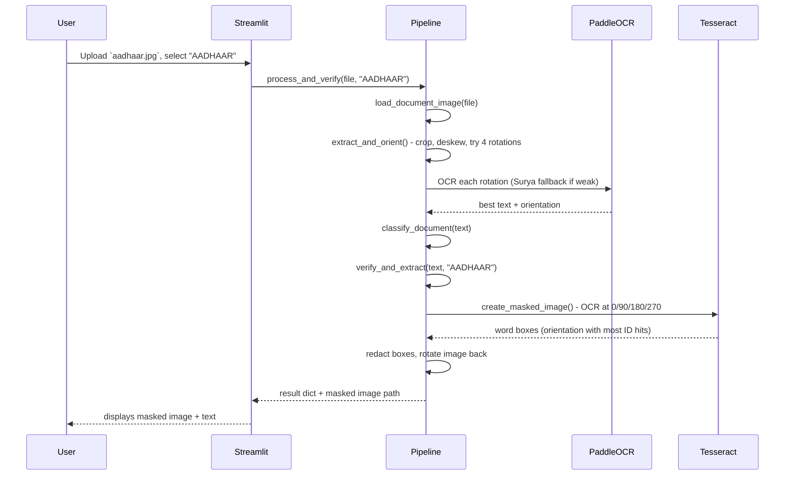
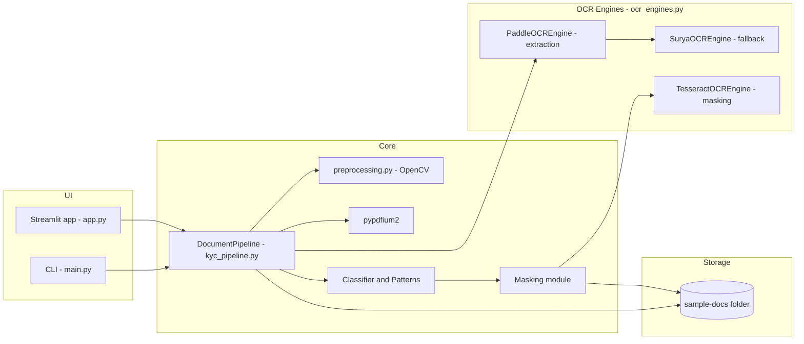
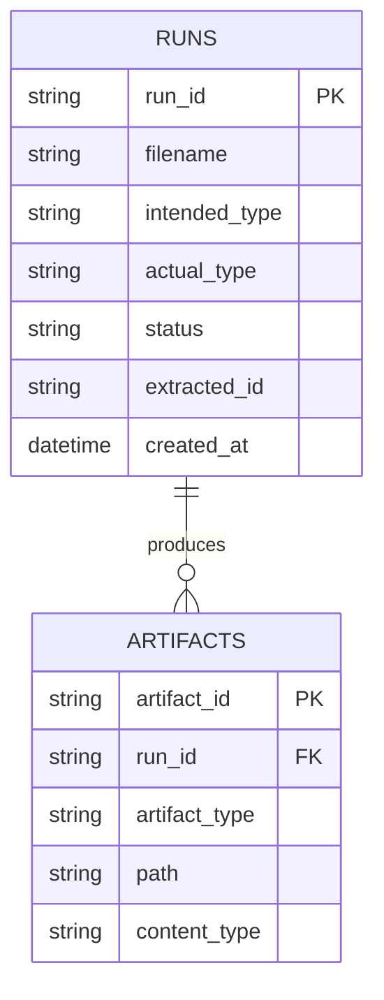

## KYC Verification Pipeline

Demo pipeline for Indian KYC document classification, verification, OCR extraction and physical redaction (masking).

Supported document types: **Aadhaar, PAN, Voter ID, Passport, Driving License**.

This repository contains a CLI and a Streamlit UI to run the KYC pipeline implemented in `kyc_pipeline.py`.

### What is included
- `kyc_pipeline.py` - main `DocumentPipeline`: loads images/PDFs, runs OCR, classifies documents, extracts IDs, and creates masked images.
- `ocr_engines.py` - OCR engine wrappers: `PaddleOCREngine`, `SuryaOCREngine`, `TesseractOCREngine`, plus the fallback-selection logic.
- `preprocessing.py` - OpenCV preprocessing: auto-crop, deskew, enhancement, resizing and 90° rotation helpers.
- `main.py` - interactive terminal program to run the pipeline.
- `app.py` - Streamlit dashboard for quick uploads and visual results.
- `sample-docs/` - storage folder for sample inputs and masked outputs (`sample-docs/mask_debug/` holds masking debug overlays).

---

## How it works

The pipeline uses **two OCR engines for two different jobs**:

1. **Text extraction & classification — PaddleOCR (Surya fallback).**
   PaddleOCR reads the document cleanly. The image is auto-cropped, deskewed, and tried at all four 90° rotations; the orientation with the best OCR text/confidence is kept. If PaddleOCR output is weak (too little text, low confidence, or multilingual), it falls back to SuryaOCR.

2. **Masking / redaction — Tesseract.**
   PaddleOCR returns *line-level* boxes, which over-redact (large vertical/horizontal black bars). Masking instead uses Tesseract's tight *word-level* boxes. The masking stage is **orientation-robust**: it independently tries all four 90° rotations and masks in the one where Tesseract reads the ID best — so sideways/vertical scans (common with Voter ID cards) are masked correctly. The redacted image is then rotated back to the original orientation before saving.

What gets masked: the sensitive part of the detected ID number is covered with a solid black box. For Aadhaar the first 8 digits are redacted and the last 4 are left visible (`XXXX XXXX 1234`).

---

## Setup

Prerequisites:

- Python 3.8+ (3.10 recommended)
- **Tesseract OCR binary** — required for the masking stage.
  - macOS: `brew install tesseract`
  - Ubuntu/Debian: `sudo apt install tesseract-ocr`
  - Verify with `tesseract --version`.
- OCR engines (installed via `requirements.txt`):
  - PaddleOCR — primary extraction engine
  - SuryaOCR — optional extraction fallback
  - pytesseract — Python binding for the Tesseract masking engine

Create and activate a virtual environment (recommended):

```bash
python3 -m venv .venv
source .venv/bin/activate
```

Install Python dependencies:

```bash
pip install -r requirements.txt
```

Notes on packages:
- `pypdfium2` rasterizes PDF pages. Install docs: https://pypdfium2.readthedocs.io/
- `opencv-python-headless` is used to avoid GUI dependencies.
- `paddleocr` is the primary OCR engine and pulls in `paddlepaddle`; install can take a while.
- `surya-ocr` is the optional extraction fallback.
- If Tesseract is not installed, masking silently falls back to PaddleOCR (lower quality) — install the binary for best results.

---

## Run (Terminal / CLI)

```bash
python main.py
```

Follow the prompts to select the document type and enter the full path to the image or PDF file.

Hints:
- Supported input types: `jpg, jpeg, png, webp, pdf`.
- Output masked images and temporary files are saved under `sample-docs/`.
- Masking debug overlays (green boxes showing detected regions) are saved under `sample-docs/mask_debug/`.

---

## Run (Streamlit UI)

```bash
streamlit run app.py
```

This opens a browser window (or gives a local URL) where you select an intended document type and upload an image or PDF.

UI behavior:
- Use the left panel to pick a document type and upload the file.
- Click "Execute KYC Pipeline" to run. Results, masked image preview, and raw OCR text appear on the right.

---

## Troubleshooting / Tips

- If OCR returns no text or unexpected results, try a higher-resolution or clearer scan.
- If masking produces no black boxes, ensure the `tesseract` binary is on your PATH (`tesseract --version`).
- Sideways/vertical scans are handled automatically — the masking stage detects the correct orientation itself.
- For PDFs with multiple pages, only the first page is processed.

## License & Attribution

Provided as-is for testing and demonstration purposes.

---

## Architecture Diagrams (Mermaid)

Diagrams for the flow and architecture. GitHub and many Markdown renderers support Mermaid; otherwise paste the blocks into https://mermaid.live.

### 1) Data Flow Diagram (DFD)



Short explanation: The user uploads a document via the Streamlit UI (or CLI). The file is saved to `sample-docs/` and passed to `DocumentPipeline`. PDFs are rasterized with `pypdfium2`; images are cropped/deskewed/rotated by OpenCV. **PaddleOCR** extracts text (falling back to **SuryaOCR** on weak output), which feeds the classifier and pattern matcher. Once an ID is found, the masking stage runs **Tesseract** to get tight word boxes, redacts the sensitive region, and writes the masked image back to `sample-docs/`.

### 2) Overall System Flow



### 3) Sequence (detailed single-request run)



### 4) High-Level Design (HLD) / Component Diagram



Short HLD note: `DocumentPipeline` orchestrates PDF rendering, image preprocessing, OCR extraction, classification, ID extraction, and masking. Extraction uses PaddleOCR (Surya fallback); masking uses Tesseract for tight word-level boxes. The UI layers simply persist an uploaded file and call the pipeline.

### 5) ER Diagram (Artifacts & Metadata)

This project currently uses the filesystem for outputs rather than a database. The ER diagram below models a possible minimal persistence schema if you want to store runs and artifacts in a DB.



Explanation: A `RUNS` table stores each pipeline execution (intent, result, extracted id). `ARTIFACTS` stores file outputs (masked images, original upload) linked to runs by `run_id`.
